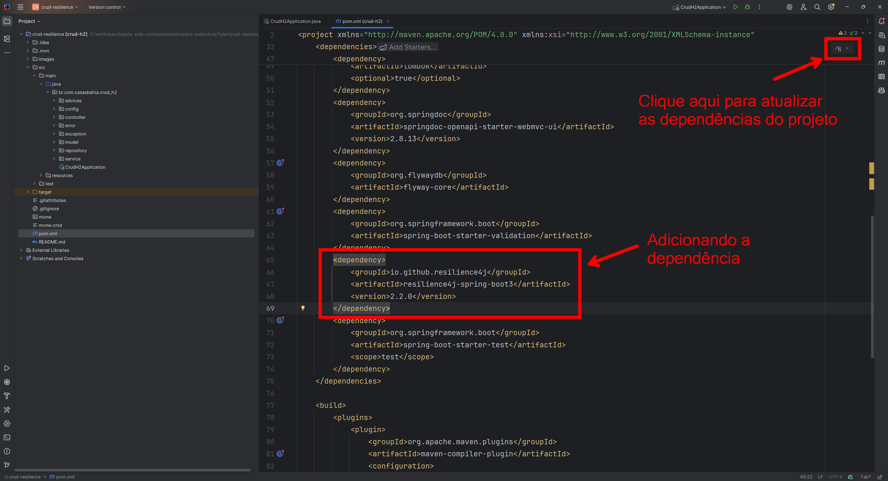
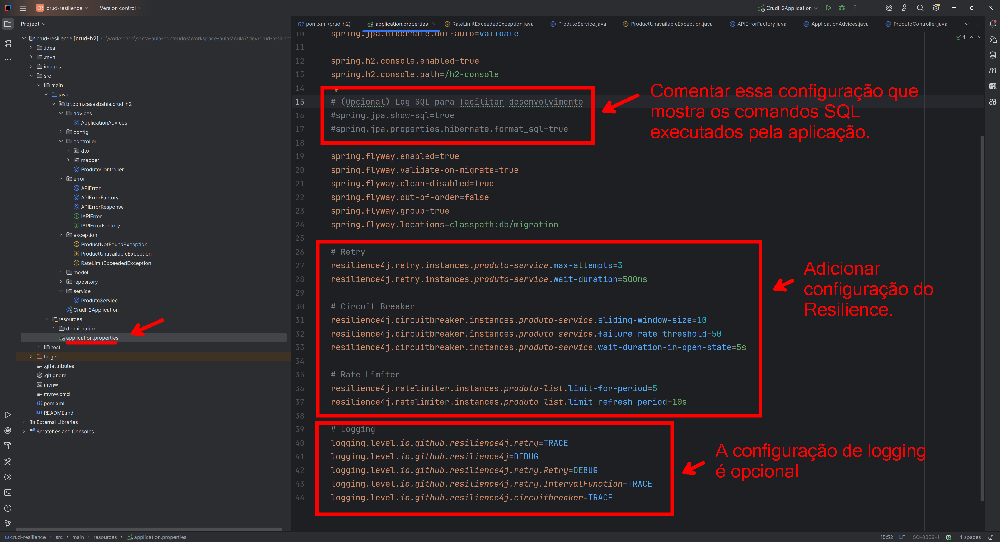
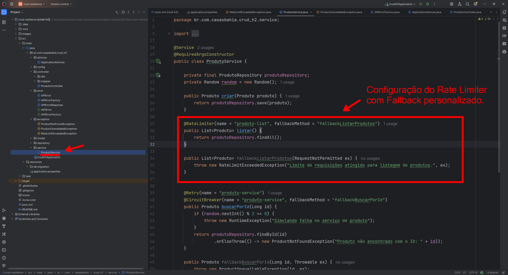
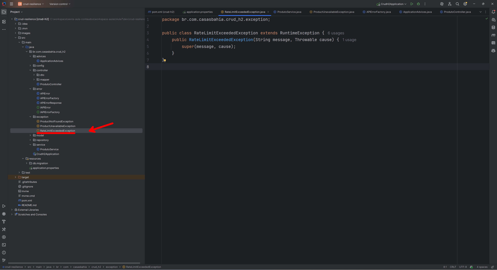
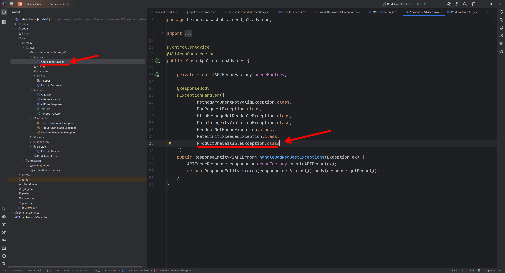
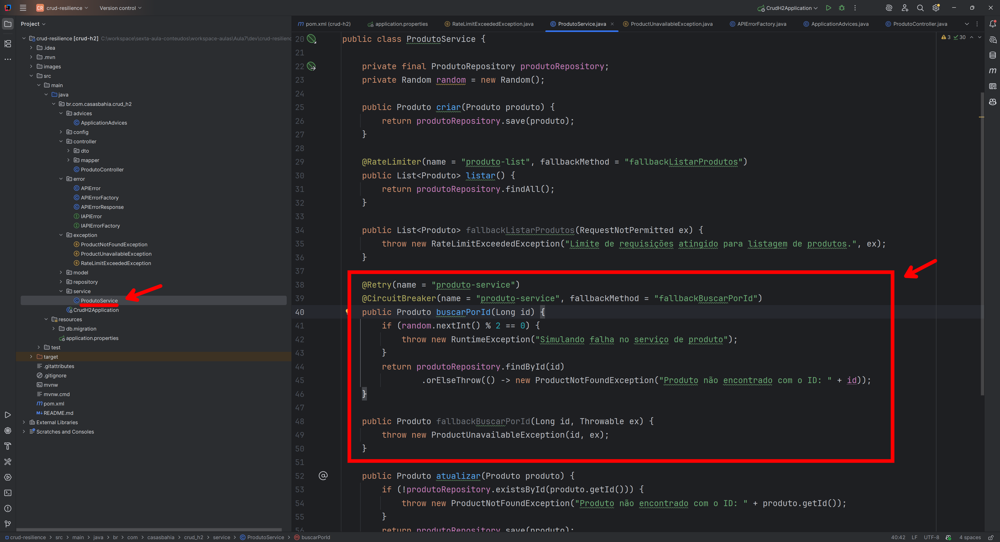
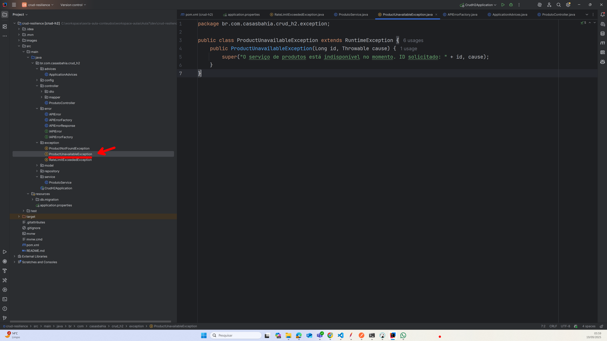
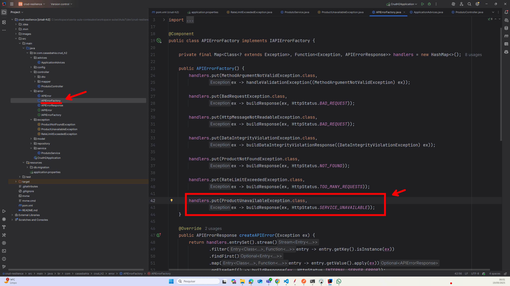
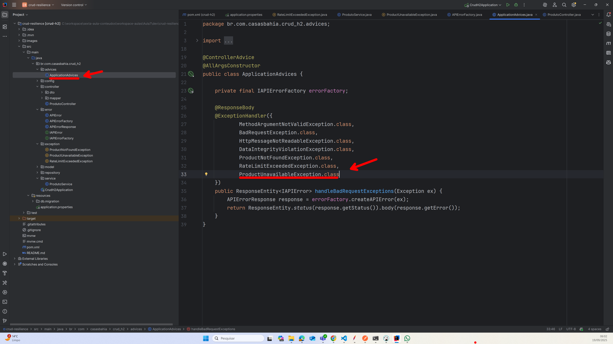

# ⚡ Tolerância a Falhas com Resilience4j


## 🎯 Objetivo da Aula

Aprender a implementar **mecanismos de resiliência** em microserviços Java usando o **Resilience4j**.
O objetivo é tornar nossas aplicações mais **tolerantes a falhas**, reduzindo o impacto de indisponibilidades externas, falhas temporárias e problemas de desempenho.

✅ Após esta aula você será capaz de:

* Configurar **Retry** para tentativas automáticas de chamadas.
* Utilizar **Circuit Breaker** para evitar sobrecarregar serviços indisponíveis.
* Implementar **Fallbacks** para respostas alternativas.
* Aplicar **Rate Limiter** para limitar chamadas e proteger recursos.
* Monitorar os comportamentos resilientes via logs e métricas.

---

## ⚙️ Pré-requisitos 🧑‍💻

* ☕ Java 21
* 🍃 Spring Boot 3.x
* 📜 Springdoc OpenAPI (Aula 3)
* 🗄️ Aula 6 do CRUD de Produtos (CRUD + Swagger + Migrations + Validações + Exceptions)

👉 Evoluímos o projeto da **Aula 6: Tratamento de Erros em APIs Java**, adicionando agora camadas de resiliência.

* Repositório base: [https://github.com/alonsodecarli-via/crud-exception](https://github.com/alonsodecarli-via/crud-exception)

---

## 🧩 O que é o Resilience4j?

O **Resilience4j** é uma biblioteca inspirada no Netflix Hystrix, mas feita sob medida para aplicações Java 8+.

### ✅ Principais módulos

* 🔄 **Retry** → repete chamadas automaticamente em caso de falhas.
* 🔌 **Circuit Breaker** → abre o circuito após várias falhas, evitando sobrecarga.
* 🛟 **Fallback** → define resposta alternativa quando ocorre uma falha.
* 🚦 **Rate Limiter** → limita a quantidade de requisições em um período.
* ⏳ **Bulkhead** → isola recursos para evitar efeito cascata.
* 🕒 **TimeLimiter** → define timeout para chamadas.

No estudo de caso desta aula, focaremos em **Retry**, **Circuit Breaker**, **Fallback** e **Rate Limiter**.

<br>

---

## 1️⃣ Adicionando dependência no `pom.xml`

- No arquivo `pom.xml`, adicionamos a dependência do Resilience4j para Spring Boot 3:
  ```xml
  <dependency>
      <groupId>io.github.resilience4j</groupId>
      <artifactId>resilience4j-spring-boot3</artifactId>
      <version>2.2.0</version>
  </dependency>
  ```

  

Após salvar, o Maven fará o download automático da biblioteca.

<br>

---

## 2️⃣ Configurações no `application.properties`
- Adicionamos configurações para o Resilience4j, além das já existentes para o H2 e JPA.

  ```properties
  spring.application.name=crud-h2
  server.port=8080

  # Configuração da fonte de dados H2
  spring.datasource.url=jdbc:h2:mem:produtosdb;DB_CLOSE_DELAY=-1;DB_CLOSE_ON_EXIT=FALSE
  spring.datasource.driver-class-name=org.h2.Driver
  spring.datasource.username=sa
  spring.datasource.password=

  # Dialeto e estratégia de criação de schema
  spring.jpa.database-platform=org.hibernate.dialect.H2Dialect
  spring.jpa.hibernate.ddl-auto=validate

  # Habilita o console web do H2
  spring.h2.console.enabled=true
  spring.h2.console.path=/h2-console

  # (Opcional) Log SQL para facilitar desenvolvimento
  #spring.jpa.show-sql=true
  #spring.jpa.properties.hibernate.format_sql=true

  spring.flyway.enabled=true
  spring.flyway.validate-on-migrate=true
  spring.flyway.clean-disabled=true
  spring.flyway.out-of-order=false
  spring.flyway.group=true
  spring.flyway.locations=classpath:db/migration

  # Retry
  resilience4j.retry.instances.produto-service.max-attempts=3
  resilience4j.retry.instances.produto-service.wait-duration=500ms

  # Circuit Breaker
  resilience4j.circuitbreaker.instances.produto-service.sliding-window-size=10
  resilience4j.circuitbreaker.instances.produto-service.failure-rate-threshold=50
  resilience4j.circuitbreaker.instances.produto-service.wait-duration-in-open-state=5s

  # Rate Limiter
  resilience4j.ratelimiter.instances.produto-list.limit-for-period=5
  resilience4j.ratelimiter.instances.produto-list.limit-refresh-period=10s

  # Logging
  logging.level.io.github.resilience4j.retry=TRACE
  logging.level.io.github.resilience4j=DEBUG
  logging.level.io.github.resilience4j.retry.Retry=DEBUG
  logging.level.io.github.resilience4j.retry.IntervalFunction=TRACE
  logging.level.io.github.resilience4j.circuitbreaker=TRACE

  ```
  


- Essas configurações definem os parâmetros para Retry, Circuit Breaker e Rate Limiter:
  - **Retry**: tenta novamente até 3 vezes, esperando 500ms entre tentativas.
  - **Circuit Breaker**: abre o circuito se mais de 50% das últimas 10 chamadas falharem, permanecendo aberto por 5 segundos.
  - **Rate Limiter**: permite até 5 chamadas a cada 10 segundos.  
  - **Logging**: ativa logs detalhados para monitorar o comportamento do Resilience4j.
  - **Nomenclatura**: usamos `produto-service` para operações de busca por ID e `produto-list` para listagem de produtos.

---


## ⚡ Configurações Resilience4j


### 🔁 Retry – `produto-service`

- Configuração no `application.properties`:

  ```properties
  resilience4j.retry.instances.produto-service.max-attempts=3
  resilience4j.retry.instances.produto-service.wait-duration=500ms
  ```


✨ **Como funciona:**

* Até **3 tentativas**
* Intervalo de **500ms** entre cada tentativa
* 💡 Útil para **falhas temporárias** (ex.: timeouts momentâneos)

---

### ⚡ Circuit Breaker – `produto-service`

- Configuração no `application.properties`:

  ```properties
  resilience4j.circuitbreaker.instances.produto-service.sliding-window-size=10
  resilience4j.circuitbreaker.instances.produto-service.failure-rate-threshold=50
  resilience4j.circuitbreaker.instances.produto-service.wait-duration-in-open-state=5s
  ```


✨ **Como funciona:**

* 📊 Analisa **últimas 10 chamadas**
* 🚨 Se **50% falharem** → abre o circuito por **5s**
* 🔄 Depois entra em **half-open** para testar se pode fechar


**Propriedades configuráveis:**
- 🧮 `sliding-window-size`: Quantidade de chamadas monitoradas (janela deslizante).
- 📉`failure-rate-threshold`: Percentual de falhas para abrir o circuito (ex: 50%).
- ⏱️`wait-duration-in-open-state`: Tempo que o circuito fica aberto antes de testar de novo
- 🚪`permitted-number-of-calls-in-half-open-state`: Número de chamadas de teste em HALF_OPEN.
- 🔢 `minimum-number-of-calls`: Mínimo de chamadas necessárias para avaliar falha/taxa.

🧠 **Estados do Circuit Breaker:**
- ✅ **CLOSED**: Tudo normal, chamadas passam.
- 🔴 **OPEN**: Muitas falhas, chamadas são bloqueadas.
- 🌓 **HALF_OPEN**: Testa se o serviço voltou, permitindo algumas chamadas.


---

### 🚦 Rate Limiter – `produto-list`

- Configuração no `application.properties`:

  ```properties
  resilience4j.ratelimiter.instances.produto-list.limit-for-period=5
  resilience4j.ratelimiter.instances.produto-list.limit-refresh-period=10s
  ```


✨ **Como funciona:**

* 🎯 Permite no máximo **5 chamadas a cada 10 segundos**
* 🛡 Protege o serviço contra **sobrecarga** ou chamadas excessivas

---

### 🪵 Logging – Depuração


logging.level.io.github.resilience4j=DEBUG
logging.level.io.github.resilience4j.retry=TRACE
logging.level.io.github.resilience4j.retry.Retry=DEBUG
logging.level.io.github.resilience4j.retry.IntervalFunction=TRACE
logging.level.io.github.resilience4j.circuitbreaker=TRACE


✨ **Como funciona:**

* 🔍 Ativa logs detalhados do Resilience4j
* ⚠ Ideal para **desenvolvimento** (cuidado em produção)

---

## 📌 Resumo dos Componentes Ativos

| Operação          | Tipo                    | Finalidade                                             |
| ----------------- | ----------------------- | ------------------------------------------------------ |
| `produto-service` | Retry + Circuit Breaker | Busca produto por ID → tolerância a falhas temporárias |
| `produto-list`    | Rate Limiter            | Listagem de produtos → controle de volume de acessos   |


<br>


---

## 3️⃣ Implmentando o Rate Limiter

- No `ProdutoService`, adicionamos a anotação `@RateLimiter` no método `listar`, associando ao nome configurado `produto-list`.

  ```java
  package br.com.casasbahia.crud_h2.service;

  import br.com.casasbahia.crud_h2.exception.ProductNotFoundException;
  import br.com.casasbahia.crud_h2.exception.RateLimitExceededException;
  import br.com.casasbahia.crud_h2.model.Produto;
  import br.com.casasbahia.crud_h2.repository.ProdutoRepository;
  import io.github.resilience4j.circuitbreaker.annotation.CircuitBreaker;
  import io.github.resilience4j.ratelimiter.RequestNotPermitted;
  import io.github.resilience4j.ratelimiter.annotation.RateLimiter;
  import io.github.resilience4j.retry.annotation.Retry;
  import lombok.RequiredArgsConstructor;
  import org.springframework.stereotype.Service;

  import java.util.List;

  @Service
  @RequiredArgsConstructor
  public class ProdutoService {

      private final ProdutoRepository produtoRepository;

      public Produto criar(Produto produto) {
          return produtoRepository.save(produto);
      }

      @RateLimiter(name = "produto-list", fallbackMethod = "fallbackListarProdutos")
      public List<Produto> listar() {
          return produtoRepository.findAll();
      }

      public List<Produto> fallbackListarProdutos(RequestNotPermitted ex) {
          throw new RateLimitExceededException("Limite de requisições atingido para listagem de produtos.", ex);
      }

      public Produto buscarPorId(Long id) {
          return produtoRepository.findById(id)
                  .orElseThrow(() -> new ProductNotFoundException("Produto não encontrado com o ID: " + id));
      }

      public Produto atualizar(Produto produto) {
          if (!produtoRepository.existsById(produto.getId())) {
              throw new ProductNotFoundException("Produto não encontrado com o ID: " + produto.getId());
          }
          return produtoRepository.save(produto);
      }

      public void deletar(Long id) {
          if (!produtoRepository.existsById(id)) {
              throw new ProductNotFoundException("Produto não encontrado com o ID: " + id);
          }
          produtoRepository.deleteById(id);
      }

  }

  ```

  


  - A anotação `@RateLimiter` limita o número de chamadas ao método conforme configurado.
  - O método `fallbackListarProdutos` é chamado quando o limite é excedido, lançando uma exceção personalizada.
  - **Nome do Rate Limiter**: `produto-list` (conforme definido no `application.properties`).

<br>

- Segue a implementação da exceção personalizada `RateLimitExceededException`:

  ```java
  package br.com.casasbahia.crud_h2.exception;

  public class RateLimitExceededException extends RuntimeException {
      public RateLimitExceededException(String message, Throwable cause) {
          super(message, cause);
      }
  }
  ```

  


<br>

- Atualizamos a `APIErrorFactory` para mapear a nova exceção e retornar o status HTTP 429 (Too Many Requests):

  ```java
  package br.com.casasbahia.crud_h2.error;

  import br.com.casasbahia.crud_h2.exception.ProductNotFoundException;
  import br.com.casasbahia.crud_h2.exception.RateLimitExceededException;
  import org.apache.coyote.BadRequestException;
  import org.springframework.dao.DataIntegrityViolationException;
  import org.springframework.http.HttpStatus;
  import org.springframework.http.converter.HttpMessageNotReadableException;
  import org.springframework.stereotype.Component;
  import org.springframework.web.bind.MethodArgumentNotValidException;

  import java.util.HashMap;
  import java.util.Map;
  import java.util.Optional;
  import java.util.function.Function;

  @Component
  public class APIErrorFactory implements IAPIErrorFactory {

      private final Map<Class<? extends Exception>, Function<Exception, APIErrorResponse>> handlers = new HashMap<>();

      public APIErrorFactory() {
          handlers.put(MethodArgumentNotValidException.class,
                  ex -> handleValidationException((MethodArgumentNotValidException) ex));

          handlers.put(BadRequestException.class,
                  ex -> buildResponse(ex, HttpStatus.BAD_REQUEST));

          handlers.put(HttpMessageNotReadableException.class,
                  ex -> buildResponse(ex, HttpStatus.BAD_REQUEST));

          handlers.put(DataIntegrityViolationException.class,
                  ex -> buildDataIntegrityViolationResponse((DataIntegrityViolationException) ex));

          handlers.put(ProductNotFoundException.class,
                  ex -> buildResponse(ex, HttpStatus.NOT_FOUND));

          handlers.put(RateLimitExceededException.class,
                  ex -> buildResponse(ex, HttpStatus.TOO_MANY_REQUESTS));

      }

      @Override
      public APIErrorResponse createAPIError(Exception ex) {
          return handlers.entrySet().stream()
                  .filter(entry -> entry.getKey().isInstance(ex))
                  .findFirst()
                  .map(entry -> entry.getValue().apply(ex))
                  .orElseGet(() -> buildResponse(ex, HttpStatus.INTERNAL_SERVER_ERROR));
      }


      private APIErrorResponse handleValidationException(MethodArgumentNotValidException ex) {
          APIError apiError = new APIError(HttpStatus.BAD_REQUEST.value());
          ex.getBindingResult().getFieldErrors().forEach(error -> {
              String message = error.getField() + ": " + error.getDefaultMessage();
              apiError.addMessage(message);
          });
          return new APIErrorResponse(HttpStatus.BAD_REQUEST, apiError);
      }

      private APIErrorResponse buildDataIntegrityViolationResponse(DataIntegrityViolationException ex) {
          APIError apiError = new APIError(HttpStatus.CONFLICT.value());

          String rootCauseMessage = Optional.ofNullable(ex.getRootCause())
                  .map(Throwable::getMessage)
                  .orElse(ex.getMessage());

          if (rootCauseMessage != null && rootCauseMessage.contains("UK_PRODUTOS_NCM")) {
              apiError.addMessage("ncm: Já existe um produto com esse NCM.");
          } else {
              apiError.addMessage("Erro de integridade de dados: " + rootCauseMessage);
          }

          return new APIErrorResponse(HttpStatus.CONFLICT, apiError);
      }


      private APIErrorResponse buildResponse(Exception ex, HttpStatus status) {
          APIError apiError = new APIError(status.value());
          apiError.addMessage(ex.getMessage());
          return new APIErrorResponse(status, apiError);
      }
  }
  ```

  

<br>

- Atualizamos o `ApplicationAdvices` para incluir a nova exceção no tratamento global:

  ```java
  package br.com.casasbahia.crud_h2.advices;

  import br.com.casasbahia.crud_h2.error.APIErrorResponse;
  import br.com.casasbahia.crud_h2.error.IAPIError;
  import br.com.casasbahia.crud_h2.error.IAPIErrorFactory;
  import br.com.casasbahia.crud_h2.exception.ProductNotFoundException;
  import br.com.casasbahia.crud_h2.exception.RateLimitExceededException;
  import lombok.AllArgsConstructor;
  import org.apache.coyote.BadRequestException;
  import org.springframework.dao.DataIntegrityViolationException;
  import org.springframework.http.ResponseEntity;
  import org.springframework.http.converter.HttpMessageNotReadableException;
  import org.springframework.web.bind.MethodArgumentNotValidException;
  import org.springframework.web.bind.annotation.ControllerAdvice;
  import org.springframework.web.bind.annotation.ExceptionHandler;
  import org.springframework.web.bind.annotation.ResponseBody;


  @ControllerAdvice
  @AllArgsConstructor
  public class ApplicationAdvices {

      private final IAPIErrorFactory errorFactory;

      @ResponseBody
      @ExceptionHandler({
              MethodArgumentNotValidException.class,
              BadRequestException.class,
              HttpMessageNotReadableException.class,
              DataIntegrityViolationException.class,
              ProductNotFoundException.class,
              RateLimitExceededException.class
      })
      public ResponseEntity<IAPIError> handleBadRequestExceptions(Exception ex) {
          APIErrorResponse response = errorFactory.createAPIError(ex);
          return ResponseEntity.status(response.getStatus()).body(response.getError());
      }
  }
  ´´´

  


<br>
<br>

---

## 4️⃣ Implementando Retry e Circuit Breaker

- No `ProdutoService`, adicionamos as anotações `@Retry` e `@CircuitBreaker` no método `buscarPorId`.

  ```java
  package br.com.casasbahia.crud_h2.service;

  import br.com.casasbahia.crud_h2.exception.ProductNotFoundException;
  import br.com.casasbahia.crud_h2.exception.ProductUnavailableException;
  import br.com.casasbahia.crud_h2.exception.RateLimitExceededException;
  import br.com.casasbahia.crud_h2.model.Produto;
  import br.com.casasbahia.crud_h2.repository.ProdutoRepository;
  import io.github.resilience4j.circuitbreaker.annotation.CircuitBreaker;
  import io.github.resilience4j.ratelimiter.RequestNotPermitted;
  import io.github.resilience4j.ratelimiter.annotation.RateLimiter;
  import io.github.resilience4j.retry.annotation.Retry;
  import lombok.RequiredArgsConstructor;
  import org.springframework.stereotype.Service;

  import java.util.List;
  import java.util.Random;

  @Service
  @RequiredArgsConstructor
  public class ProdutoService {

      private final ProdutoRepository produtoRepository;
      private Random random = new Random();

      public Produto criar(Produto produto) {
          return produtoRepository.save(produto);
      }

      @RateLimiter(name = "produto-list", fallbackMethod = "fallbackListarProdutos")
      public List<Produto> listar() {
          return produtoRepository.findAll();
      }

      public List<Produto> fallbackListarProdutos(RequestNotPermitted ex) {
          throw new RateLimitExceededException("Limite de requisições atingido para listagem de produtos.", ex);
      }
      
      @Retry(name = "produto-service")
      @CircuitBreaker(name = "produto-service", fallbackMethod = "fallbackBuscarPorId")
      public Produto buscarPorId(Long id) {
          if (random.nextInt() % 2 == 0) {
              throw new RuntimeException("Simulando falha no serviço de produto");
          }
          return produtoRepository.findById(id)
                  .orElseThrow(() -> new ProductNotFoundException("Produto não encontrado com o ID: " + id));
      }

      public Produto fallbackBuscarPorId(Long id, Throwable ex) {
          throw new ProductUnavailableException(id, ex);
      }

      public Produto atualizar(Produto produto) {
          if (!produtoRepository.existsById(produto.getId())) {
              throw new ProductNotFoundException("Produto não encontrado com o ID: " + produto.getId());
          }
          return produtoRepository.save(produto);
      }

      public void deletar(Long id) {
          if (!produtoRepository.existsById(id)) {
              throw new ProductNotFoundException("Produto não encontrado com o ID: " + id);
          }
          produtoRepository.deleteById(id);
      }

  }
  ```

  

  - A anotação `@Retry` tenta novamente a operação em caso de falha, conforme configurado.
  - A anotação `@CircuitBreaker` monitora as falhas e abre o circuito se o limite for atingido.
  - O método `fallbackBuscarPorId` é chamado quando o circuito está aberto, lançando uma exceção personalizada.
  - **Nome do Circuit Breaker e Retry**: `produto-service` (conforme definido no `application.properties`).

<br>


- Segue a implementação da exceção personalizada `ProductUnavailableException`:

  ```java
  package br.com.casasbahia.crud_h2.exception;

  public class ProductUnavailableException extends RuntimeException {
      public ProductUnavailableException(Long id, Throwable cause) {
          super("O serviço de produtos está indisponível no momento. ID solicitado: " + id, cause);
      }
  }
  ```
  

<br>

- Atualizamos a `APIErrorFactory` para mapear a nova exceção e retornar o status HTTP 503 (Service Unavailable):

  ```java
  package br.com.casasbahia.crud_h2.error;

  import br.com.casasbahia.crud_h2.exception.ProductNotFoundException;
  import br.com.casasbahia.crud_h2.exception.ProductUnavailableException;
  import br.com.casasbahia.crud_h2.exception.RateLimitExceededException;
  import org.apache.coyote.BadRequestException;
  import org.springframework.dao.DataIntegrityViolationException;
  import org.springframework.http.HttpStatus;
  import org.springframework.http.converter.HttpMessageNotReadableException;
  import org.springframework.stereotype.Component;
  import org.springframework.web.bind.MethodArgumentNotValidException;

  import java.util.HashMap;
  import java.util.Map;
  import java.util.Optional;
  import java.util.function.Function;

  @Component
  public class APIErrorFactory implements IAPIErrorFactory {

      private final Map<Class<? extends Exception>, Function<Exception, APIErrorResponse>> handlers = new HashMap<>();

      public APIErrorFactory() {
          handlers.put(MethodArgumentNotValidException.class,
                  ex -> handleValidationException((MethodArgumentNotValidException) ex));

          handlers.put(BadRequestException.class,
                  ex -> buildResponse(ex, HttpStatus.BAD_REQUEST));

          handlers.put(HttpMessageNotReadableException.class,
                  ex -> buildResponse(ex, HttpStatus.BAD_REQUEST));

          handlers.put(DataIntegrityViolationException.class,
                  ex -> buildDataIntegrityViolationResponse((DataIntegrityViolationException) ex));

          handlers.put(ProductNotFoundException.class,
                  ex -> buildResponse(ex, HttpStatus.NOT_FOUND));

          handlers.put(RateLimitExceededException.class,
                  ex -> buildResponse(ex, HttpStatus.TOO_MANY_REQUESTS));

          handlers.put(ProductUnavailableException.class,
                  ex -> buildResponse(ex, HttpStatus.SERVICE_UNAVAILABLE));
      }

      @Override
      public APIErrorResponse createAPIError(Exception ex) {
          return handlers.entrySet().stream()
                  .filter(entry -> entry.getKey().isInstance(ex))
                  .findFirst()
                  .map(entry -> entry.getValue().apply(ex))
                  .orElseGet(() -> buildResponse(ex, HttpStatus.INTERNAL_SERVER_ERROR));
      }


      private APIErrorResponse handleValidationException(MethodArgumentNotValidException ex) {
          APIError apiError = new APIError(HttpStatus.BAD_REQUEST.value());
          ex.getBindingResult().getFieldErrors().forEach(error -> {
              String message = error.getField() + ": " + error.getDefaultMessage();
              apiError.addMessage(message);
          });
          return new APIErrorResponse(HttpStatus.BAD_REQUEST, apiError);
      }

      private APIErrorResponse buildDataIntegrityViolationResponse(DataIntegrityViolationException ex) {
          APIError apiError = new APIError(HttpStatus.CONFLICT.value());

          String rootCauseMessage = Optional.ofNullable(ex.getRootCause())
                  .map(Throwable::getMessage)
                  .orElse(ex.getMessage());

          if (rootCauseMessage != null && rootCauseMessage.contains("UK_PRODUTOS_NCM")) {
              apiError.addMessage("ncm: Já existe um produto com esse NCM.");
          } else {
              apiError.addMessage("Erro de integridade de dados: " + rootCauseMessage);
          }

          return new APIErrorResponse(HttpStatus.CONFLICT, apiError);
      }


      private APIErrorResponse buildResponse(Exception ex, HttpStatus status) {
          APIError apiError = new APIError(status.value());
          apiError.addMessage(ex.getMessage());
          return new APIErrorResponse(status, apiError);
      }
  }
  ```

  


<br>

- Atualizamos o `ApplicationAdvices` para incluir a nova exceção no tratamento global:

  ```java
  package br.com.casasbahia.crud_h2.advices;

  import br.com.casasbahia.crud_h2.error.APIErrorResponse;
  import br.com.casasbahia.crud_h2.error.IAPIError;
  import br.com.casasbahia.crud_h2.error.IAPIErrorFactory;
  import br.com.casasbahia.crud_h2.exception.ProductNotFoundException;
  import br.com.casasbahia.crud_h2.exception.ProductUnavailableException;
  import br.com.casasbahia.crud_h2.exception.RateLimitExceededException;
  import lombok.AllArgsConstructor;
  import org.apache.coyote.BadRequestException;
  import org.springframework.dao.DataIntegrityViolationException;
  import org.springframework.http.ResponseEntity;
  import org.springframework.http.converter.HttpMessageNotReadableException;
  import org.springframework.web.bind.MethodArgumentNotValidException;
  import org.springframework.web.bind.annotation.ControllerAdvice;
  import org.springframework.web.bind.annotation.ExceptionHandler;
  import org.springframework.web.bind.annotation.ResponseBody;

  @ControllerAdvice
  @AllArgsConstructor
  public class ApplicationAdvices {

      private final IAPIErrorFactory errorFactory;

      @ResponseBody
      @ExceptionHandler({
              MethodArgumentNotValidException.class,
              BadRequestException.class,
              HttpMessageNotReadableException.class,
              DataIntegrityViolationException.class,
              ProductNotFoundException.class,
              RateLimitExceededException.class,
              ProductUnavailableException.class
      })
      public ResponseEntity<IAPIError> handleBadRequestExceptions(Exception ex) {
          APIErrorResponse response = errorFactory.createAPIError(ex);
          return ResponseEntity.status(response.getStatus()).body(response.getError());
      }
  }
  ```

  


<br>
<br>


---


## 5️⃣ Testando na Prática 🚀


### Passos para testar os mecanismos de resiliência - Rate Limiter:

1. Inicie a aplicação Spring Boot.
2. Acesse o endpoint de listagem de produtos várias vezes em rápida sucessão:
   ```HTTP
   GET http://localhost:8080/api/produtos
   ```
3. Após 5 chamadas em menos de 10 segundos, você deverá receber uma resposta com status HTTP 429 (Too Many Requests) e a mensagem de erro personalizada.


### Passos para testar os mecanismos de resiliência - Retry, Circuit Breaker:

1. Inicie a aplicação Spring Boot.
2. Acesse o endpoint de busca de produto por ID várias vezes:
   ```HTTP
   GET http://localhost:8080/api/produtos/1
   ```
3. Devido à simulação de falhas aleatórias, algumas chamadas podem falhar.
4. Observe os logs para ver as tentativas de retry e o estado do circuit breaker.
5. Se muitas falhas ocorrerem, o circuito abrirá e você verá respostas com status HTTP 503 (Service Unavailable) e a mensagem de fallback personalizada.

<br>

---

## 6️⃣ Exemplo de Resposta Fallback

- Quando o Rate Limiter for acionado, a resposta será:

  ```json
  {
    "status": 429,
    "messages": [
      "Limite de requisições atingido para listagem de produtos."
    ]
  }
  ```


- Quando o Circuit Breaker estiver aberto, a resposta será:

  ```json
  {
    "status": 503,
    "messages": [
      "O serviço de produtos está indisponível no momento. ID solicitado: 10"
    ]
  }
  ```

<br>

---

## 📊 Monitoramento

- O Resilience4j expõe **métricas** integradas com o **Micrometer** e pode ser usado junto ao **Spring Boot Actuator** para expor endpoints como:

  ```
  /actuator/metrics
  /actuator/health
  ```

📌 Essas métricas podem ser integradas ao **Prometheus + Grafana** para dashboards de resiliência.


<br>

---


## 🌱 **Benefícios da Resiliência e Autocura**


Aplicar mecanismos de resiliência traz características de **autocura (self-healing)** às aplicações:


- 🛡 **Confiabilidade** – serviços disponíveis mesmo diante de falhas temporárias.
- 🔄 **Autocura** – o sistema se recupera sozinho com Retry e Circuit Breaker.
- ⚖ **Isolamento de falhas** – impede que um serviço instável derrube todo o ecossistema.
- 📉 **Menor impacto ao usuário** – em vez de erros constantes, respostas alternativas via fallback.
- 🚀 **Experiência estável** – menos falhas percebidas, mais satisfação.
- 💰 **Redução de custos** – menos incidentes e suporte emergencial.


📌 Em resumo: aplicações mais **robustas, confiáveis e amigáveis para o usuário**.


<br>


---

## Boas Práticas 🌟

* 🔎 Sempre defina um **fallback** para operações críticas.
* ⚖️ Ajuste os parâmetros de Retry e Circuit Breaker conforme o SLA do serviço.
* 🚦 Use Rate Limiter em serviços sensíveis para evitar sobrecarga.
* 📈 Monitore os estados (CLOSED, OPEN, HALF-OPEN) do Circuit Breaker.
* 🧪 Simule falhas em ambiente de testes para validar a resiliência.

<br>

---

## 📌 Conclusão

* O **Resilience4j** adiciona tolerância a falhas de forma simples e flexível.
* Com ele, conseguimos:

  * Repetir chamadas automaticamente (**Retry**).
  * Proteger contra falhas em cascata (**Circuit Breaker**).
  * Definir respostas alternativas via **Fallback**.
  * Limitar chamadas (**Rate Limiter**).

👉 **Próxima Aula (Aula 8 – Estratégias de Testes)**: veremos como estruturar **testes unitários, de integração e E2E** em microserviços Java.
